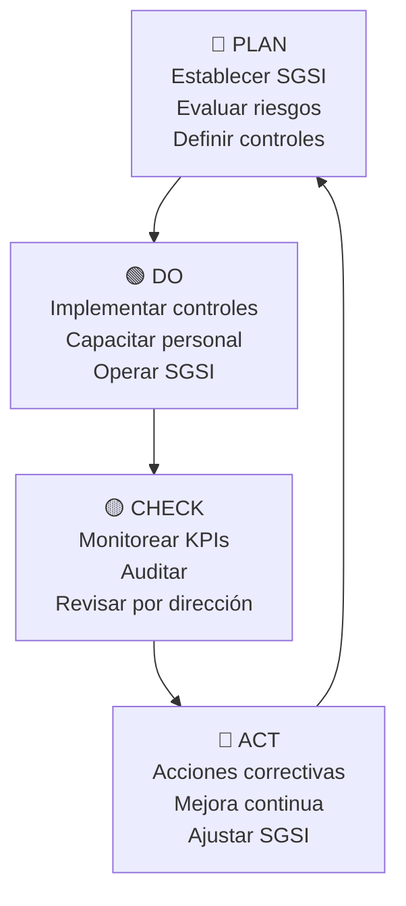

# Skill: Monitoreo y Mejora Continua del SGSI

## Propósito
Esta skill gestiona el ciclo de mejora continua (PDCA) del SGSI, definiendo métricas, KPIs, dashboards de monitoreo y procesos de revisión gerencial conforme a las **Cláusulas 9.1, 9.3, 10.1 y 10.2** de ISO 27001:2022.

## Cuándo Usar Esta Skill
- Para definir KPIs y métricas del SGSI
- Para generar informes de revisión por la dirección
- Para analizar tendencias y proponer mejoras
- Para documentar el ciclo PDCA
- Para preparar el informe anual del SGSI

## Instrucciones

### Paso 1: Definir KPIs del SGSI
Establecer indicadores clave agrupados por dominio:

#### KPIs de Gestión de Riesgos
| # | KPI | Fórmula | Meta | Frecuencia |
|---|-----|---------|------|------------|
| 1 | Riesgos críticos abiertos | Conteo de riesgos ≥20 sin tratar | 0 | Mensual |
| 2 | % de riesgos tratados | (Riesgos tratados / Total riesgos) × 100 | ≥ 90% | Trimestral |
| 3 | Riesgo promedio del inventario | Σ Riesgos / Total activos | ≤ 10 | Trimestral |
| 4 | Nuevos riesgos identificados | Conteo de nuevos riesgos en el período | Tendencia decreciente | Trimestral |

#### KPIs de Incidentes
| # | KPI | Fórmula | Meta | Frecuencia |
|---|-----|---------|------|------------|
| 5 | Nº de incidentes de seguridad | Conteo de incidentes confirmados | Tendencia decreciente | Mensual |
| 6 | Tiempo medio de detección (MTTD) | Promedio de tiempo desde ocurrencia hasta detección | ≤ 4 horas | Mensual |
| 7 | Tiempo medio de resolución (MTTR) | Promedio de tiempo desde detección hasta resolución | ≤ 24 horas | Mensual |
| 8 | Incidentes recurrentes | % de incidentes del mismo tipo repetidos | ≤ 5% | Trimestral |

#### KPIs de Cumplimiento y Control
| # | KPI | Fórmula | Meta | Frecuencia |
|---|-----|---------|------|------------|
| 9 | % de controles Anexo A implementados | (Controles implementados / Controles aplicables) × 100 | ≥ 80% | Semestral |
| 10 | Parches críticos aplicados a tiempo | (Parches aplicados en SLA / Total parches críticos) × 100 | ≥ 95% | Mensual |
| 11 | Usuarios con MFA activo | (Usuarios con MFA / Total usuarios) × 100 | 100% | Mensual |
| 12 | Backups exitosos | (Backups verificados / Total backups programados) × 100 | ≥ 99% | Semanal |

#### KPIs de Concienciación
| # | KPI | Fórmula | Meta | Frecuencia |
|---|-----|---------|------|------------|
| 13 | % de empleados capacitados | (Empleados capacitados / Total empleados) × 100 | 100% | Semestral |
| 14 | Tasa de clic en simulaciones de phishing | (Clics en phishing simulado / Total enviados) × 100 | ≤ 5% | Trimestral |
| 15 | Incidentes reportados por empleados | Conteo de reportes proactivos | Tendencia creciente | Mensual |

### Paso 2: Generar Dashboard de Monitoreo
Crear un resumen visual del estado del SGSI:

```markdown
# Dashboard SGSI — [Mes/Año]

## Estado General: 🟡 En Progreso

### Resumen de Indicadores
| Dominio | Estado | Score | Tendencia |
|---------|--------|-------|-----------|
| Gestión de Riesgos | 🟡 | 65% | ↗️ Mejorando |
| Incidentes | 🟢 | 85% | → Estable |
| Cumplimiento | 🟡 | 55% | ↗️ Mejorando |
| Concienciación | 🔴 | 30% | → Sin cambio |

### Riesgos Críticos Activos
| ID | Activo | Riesgo | Días Abierto | Acción Pendiente |
|----|--------|--------|-------------|-----------------|

### Incidentes del Período
| Tipo | Cantidad | vs. Período Anterior |
|------|----------|---------------------|

### Próximas Actividades
| Actividad | Fecha | Responsable |
|-----------|-------|-------------|
```

### Paso 3: Informe de Revisión por la Dirección (Cláusula 9.3)
Generar el informe con las entradas obligatorias según ISO 27001:

```markdown
# Informe de Revisión por la Dirección
## SGSI — [Nombre de la Empresa]
## Período: [Fecha inicio] a [Fecha fin]

### 1. Entradas de la Revisión (Requisito 9.3.2)
#### a) Estado de acciones de revisiones anteriores
#### b) Cambios en cuestiones externas e internas
#### c) Retroalimentación sobre el desempeño de SI
   - No conformidades y acciones correctivas
   - Resultados de monitoreo y medición
   - Resultados de auditorías
   - Cumplimiento de objetivos de SI
#### d) Retroalimentación de partes interesadas
#### e) Resultados de la evaluación de riesgos y estado del plan de tratamiento
#### f) Oportunidades de mejora continua

### 2. Salidas de la Revisión (Requisito 9.3.3)
#### a) Decisiones sobre oportunidades de mejora continua
#### b) Necesidades de cambios al SGSI
#### c) Necesidades de recursos

### 3. Decisiones y Acciones Tomadas
| # | Decisión/Acción | Responsable | Plazo | Prioridad |
|---|----------------|-------------|-------|-----------|

### 4. Aprobación
**Fecha de la revisión**: [DD/MM/AAAA]
**Participantes**: [Lista de asistentes]
**Próxima revisión programada**: [DD/MM/AAAA]
```

### Paso 4: Ciclo PDCA del SGSI
Documentar el estado de cada fase del ciclo:



Para cada fase, documentar:
- **Plan**: ¿Qué se planificó? ¿Se cumplió el plan?
- **Do**: ¿Qué se implementó? ¿Hubo desviaciones?
- **Check**: ¿Qué se midió? ¿Qué muestran los datos?
- **Act**: ¿Qué acciones correctivas se tomaron? ¿Qué mejoras se proponen?

### Paso 5: Análisis de Tendencias
Comparar períodos para identificar tendencias:

```markdown
## Análisis de Tendencias — Últimos [N] Períodos

### Evolución de Riesgos
| Período | Riesgos Críticos | Riesgos Altos | Riesgos Medios | Riesgos Bajos | Promedio |
|---------|-----------------|---------------|----------------|---------------|----------|
| Q1 2026 | X | X | X | X | X.X |
| Q2 2026 | X | X | X | X | X.X |

### Evolución de Incidentes
### Evolución de Cumplimiento
### Conclusiones del Análisis de Tendencias
```

### Paso 6: Proponer Acciones de Mejora
Basado en datos y tendencias, proponer acciones clasificadas:

| # | Tipo | Descripción | Impacto Esperado | Esfuerzo | Prioridad | ROI |
|---|------|-------------|-----------------|----------|-----------|-----|
| 1 | Correctiva | [Corregir una NC] | [Descripción] | [Alto/Medio/Bajo] | [Alta/Media/Baja] | [Alto/Medio/Bajo] |
| 2 | Preventiva | [Evitar un riesgo] | [Descripción] | ... | ... | ... |
| 3 | Mejora | [Optimizar proceso] | [Descripción] | ... | ... | ... |

### Formato de Salida
```
# Informe de Mejora Continua — [Nombre de la Empresa]
## 1. Dashboard del Período
## 2. Análisis de KPIs
## 3. Estado del Ciclo PDCA
## 4. Análisis de Tendencias
## 5. Acciones de Mejora Propuestas
## 6. Informe de Revisión por la Dirección
## 7. Próximos Pasos
```

### Consideraciones para TecnoGlobal
- Al ser un **SGSI nuevo**, los primeros períodos mostrarán mejoras significativas (efecto base baja)
- Priorizar KPIs sobre los **5 riesgos críticos** identificados
- Adaptar la frecuencia de medición a la **capacidad operativa de una PYME**
- Las simulaciones de phishing son especialmente relevantes dado el riesgo de **whaling/BEC al Gerente General (RH-06)**
- Incluir métricas sobre **técnicos de campo** por ser un vector de riesgo significativo
