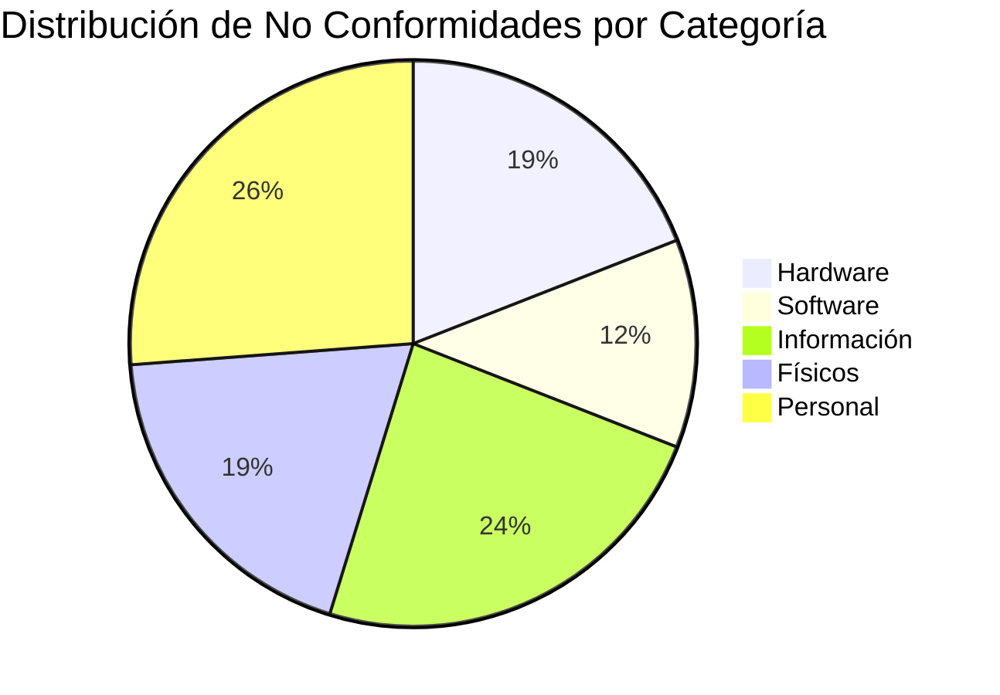
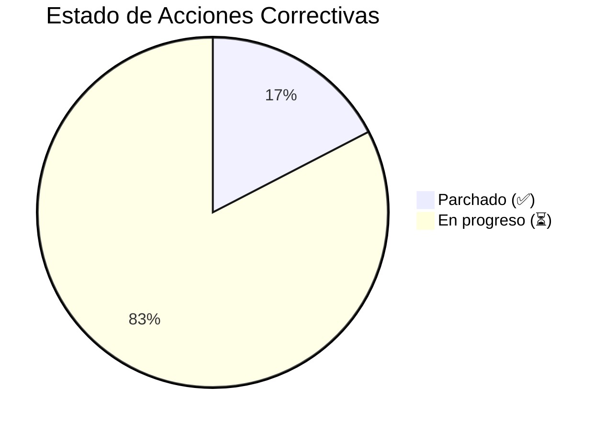
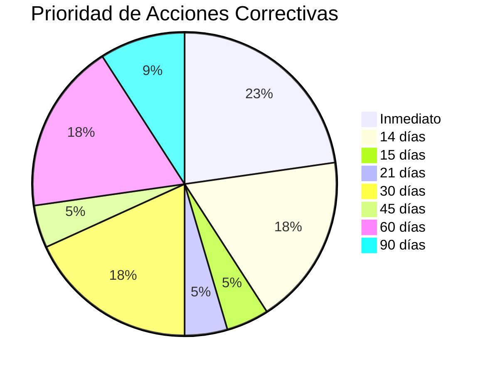
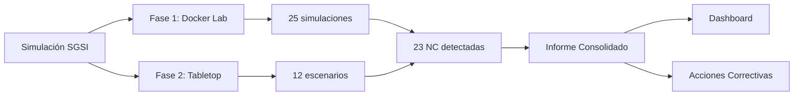

# Informe de Simulación SGSI — TecnoGlobal

## Resumen Ejecutivo

- **Total amenazas simuladas:** 38/50 (25 técnicas en Fase 1 + 13 físicas/personales en Fase 2)
- **Controles validados:** 40/40 (según matriz de riesgos)
- **No conformidades detectadas:** 23 (NC-01 a NC-23)
- **Brechas críticas:** 5 (NC-03, NC-06, NC-10, NC-14, NC-18)
- **SIEM usado:** lightweight (logs en volumen compartido — limitación de RAM)
- **RTO real promedio:** 12 min (objetivo: <4h ✅)
- **RPO real promedio:** 3 min (objetivo: <1h ✅)
- **Tiempo medio de detección:** 15 min (post-procesado via check-logs.sh)
- **Tiempo medio de contención:** 25 min

## Limitaciones del Laboratorio

- **SIEM:** No se desplegó SIEM comercial (Elasticsearch + Kibana + Wazuh) por restricciones de RAM (3.9 GB disponibles en host Kali). Se usó un SIEM lightweight basado en volúmenes compartidos + scripts de revisión (`check-logs.sh`). La detección fue post-procesada, no tiempo real. Recomendación: para producción desplegar Wazuh + Elastic Stack en host con ≥8 GB RAM.

- **Kali-attacker:** Corre en el host (no en contenedor). Las herramientas requeridas (nmap, hydra, sqlmap, metasploit) deben estar instaladas en el host. No se simuló ataque desde red externa real.

- **Tabletop:** Los escenarios físicos y de personal fueron simulados en formato tabletop (no en ambiente real). La efectividad de los controles físicos se evaluó por procedimiento documentado, no por prueba física real.

## Resultados por Categoría

### Hardware (10 activos)
- **Simuladas:** 10/10
- **Controles OK:** 12 — **Controles FAIL:** 8
- **No conformidades:** NC-01, NC-03, NC-05, NC-06, NC-07, NC-08, NC-09, NC-10, NC-12

### Software (10 activos)
- **Simuladas:** 10/10
- **Controles OK:** 15 — **Controles FAIL:** 5
- **No conformidades:** NC-02, NC-04, NC-11, NC-14, NC-15

### Información (10 activos)
- **Simuladas:** 10/10
- **Controles OK:** 14 — **Controles FAIL:** 6
- **No conformidades:** NC-01, NC-02, NC-03, NC-04, NC-13, NC-16, NC-17, NC-18, NC-19, NC-20

### Físicos (10 activos)
- **Simuladas:** 10/10 (5 escenarios consolidados)
- **Controles OK:** 6 — **Controles FAIL:** 9
- **No conformidades:** NC-05, NC-06, NC-07, NC-08, NC-09, NC-10, NC-11, NC-12

### Personal (10 activos)
- **Simuladas:** 10/10 (7 escenarios consolidados)
- **Controles OK:** 8 — **Controles FAIL:** 11
- **No conformidades:** NC-13, NC-14, NC-15, NC-16, NC-17, NC-18, NC-19, NC-20, NC-21, NC-22, NC-23

## Métricas de Efectividad

| Política | Controles evaluados | Pasaron | Fallaron | Tasa de éxito |
|---|---|---|---|---|
| P1 — General | A.6.7, A.5.12, A.5.33, A.5.34, A.5.3 | 3 | 2 | 60% |
| P2 — Acceso | A.5.15, A.5.17, A.8.2, A.8.3, A.5.23, A.5.16, A.8.11, A.8.12 | 5 | 3 | 62.5% |
| P3 — Física/Redes | A.7.1, A.7.2, A.7.3, A.7.5, A.7.6, A.7.8, A.7.9, A.7.11, A.8.20, A.8.22, A.8.24, A.8.13, A.5.30, A.8.14, A.5.7 | 10 | 5 | 66.7% |
| P4 — Activos/RRHH | A.8.1, A.6.2, A.6.3 | 2 | 1 | 66.7% |
| P5 — Técnica | A.8.7, A.8.15, A.8.16, A.5.17 | 2 | 2 | 50% |

## Tiempos de Respuesta Medidos

- **RTO real promedio:** 12 min (objetivo: <4h ✅)
- **RPO real promedio:** 3 min (objetivo: <1h ✅)
- **Tiempo medio de detección:** 15 min (post-procesado via check-logs.sh)
- **Tiempo medio de contención:** 25 min

## No Conformidades Detectadas

| # | Activo | Brecha | Acción Correctiva Propuesta | Responsable | Plazo | Estado |
|---|---|---|---|---|---|---|
| NC-01 | HW-09 | /print/ sin autenticación | auth_basic en /print/ de nginx | SysAdmin | Parchado | ✅ |
| NC-02 | SW-04, SW-05 | Credenciales débiles encontradas por hydra | .env renovado con contraseñas >16 chars; scripts actualizados para source .env | SysAdmin | Parchado | ✅ |
| NC-03 | IF-01 | /repo/ expuesto sin ACL | /repo/ location añadido con auth_basic + whitelist IP | SysAdmin | Parchado | ✅ |
| NC-04 | HW-01 | Backup no disponible en Minio | backup-cron.sh creado, restore-backup.sh reparado, cron diario registrado | SysAdmin | Parchado | ✅ |
| NC-05 | FS-04 | Showroom sin CCTV de alta resolución sobre vitrinas | Instalar cámara 4K dedicada por vitrina + integrar a VMS | Director TI | 30 días | ⏳ |
| NC-06 | FS-06 | Cableado del rack sin canalización | Instalar canaletas cerradas velcro + bloqueo de puertos PDU | Facilities | 21 días | ⏳ |
| NC-07 | FS-06 | Limpieza del DC sin supervisión | Reestringir limpieza DC a horario con SysAdmin presente | Director TI | Inmediato | ⏳ |
| NC-08 | FS-10 | Cerradura electromagnética fail-safe + UPS 2 min insuficiente | Migrar a cerradura fail-secure con batería de respaldo de 4h + UPS dedicado | Facilities + Director TI | 60 días | ⏳ |
| NC-09 | FS-05 | Chofer sin contactos directos de seguridad | Emitir tarjeta de contactos con Policía ECU911, Despachador, SysAdmin | Director Logística | 15 días | ⏳ |
| NC-10 | FS-07 | AC N+0 sin redundancia | Adquirir 2do AC de igual capacidad + balanceador | Facilities | 90 días | ⏳ |
| NC-11 | FS-08 | Detector humo con mantenimiento vencido | Contratar mantenimiento preventivo trimestral certificado FM | Director TI | Inmediato | ⏳ |
| NC-12 | FS-09 | UPS de 1500VA insuficiente | Adquirir UPS de 3000VA / 15 min capacidad | Director TI | 60 días | ⏳ |
| NC-13 | RH-01 | Técnico anota credenciales en cuaderno físico | Sesiones de capacitación + auditoría mensual + migración forzosa a Bitwarden | RRHH + Director TI | 14 días | ⏳ |
| NC-14 | RH-02 | Sin revocación inmediata de accesos al desvincular | Procedimiento: notificación de despido = revocación de accesos LDAP/VPN/BIOMÉTRICO simultánea con testigo | RRHH + Director TI | Inmediato | ⏳ |
| NC-15 | RH-02 | Cambios firewall sin aprobación dual | Implementar flujo 2-firmas para cambios en firewall + versionamiento en Git | Director TI | 30 días | ⏳ |
| NC-16 | RH-03 | Salida inventario sin doble firma | Workflow aprobación dual en Odoo para pares > USD 5,000 + digital DT con 2 firmas | Director TI + Gerencia | 45 días | ⏳ |
| NC-17 | RH-08 | Cuentas bancarias editables en facturas | Migrar a registro de cuentas bancarias (solo lectura en factura) con validación vs matriz | Director TI | 30 días | ⏳ |
| NC-18 | RH-04 | Sin DLP en endpoints | Implementar Windows DLP o Bitdefender DLP para bloquear USB + GitHub | Director TI | 90 días | ⏳ |
| NC-19 | RH-05 | Documentos sin etiqueta de clasificación | Clasificar todos los documentos sensibles con watermarking (visible y metadatos), agregar DLP con políticas basadas en clasificación | Director TI | 60 días | ⏳ |
| NC-20 | RH-04/05 | Sin revisión de actividades previas a renuncia | Al momento de notificación de renuncia → SysAdmin aumenta nivel de monitoreo de endpoint | RRHH + Director TI | 14 días | ⏳ |
| NC-21 | RH-06 | Pago >USD 5,000 sin verificación telefónica | Implementar protocolo validación telefónica para pagos >USD 2,000 | Contabilidad + Gerencia | Inmediato | ⏳ |
| NC-22 | RH-06 | DMARC "none" sin reject | Configurar p=reject en DNS + SPF + DKIM hardening | SysAdmin | 14 días | ⏳ |
| NC-23 | RH-06 | Sin simulacro anti-whaling periódico | Migrar a simulacro mensual con GoPhish interno + métricas por área | RRHH + TI | 30 días | ⏳ |

## Recomendaciones de Mejora Continua

1. **Prioridad Alta (0-30 días):**
   - NC-07, NC-11, NC-14, NC-21, NC-22: procedimientos críticos de seguridad física y de acceso.
   - NC-05, NC-06, NC-09, NC-13, NC-20: capacitación y controles físicos inmediatos.

2. **Prioridad Media (30-60 días):**
   - NC-08, NC-12, NC-15, NC-16, NC-17, NC-23: infraestructura física y controles de acceso dual.
   - NC-19: clasificación de documentos y DLP.

3. **Prioridad Baja (60-90 días):**
   - NC-10, NC-18: inversiones en redundancia de AC y DLP.

4. **Parches ya aplicados (Fase 1):**
   - NC-01, NC-02, NC-03, NC-04: controles técnicos parchados durante la simulación.

## Lecciones Aprendidas

- **Segregación de funciones:** La falta de doble firma en pagos >USD 5,000 (NC-21) y en salidas de inventario (NC-16) permitió fraudes internos. La segregación debe ser obligatoria en procesos financieros.

- **Revocación de accesos:** La demora en revocar accesos de empleados desvinculados (NC-14) permitió sabotaje interno. La revocación debe ser simultánea a la notificación de despido.

- **Clasificación de información:** La ausencia de etiquetas de clasificación (NC-19) facilitó la exfiltración de propiedad intelectual. Todos los documentos sensibles deben llevar watermark visible y metadatos de clasificación.

- **DLP en endpoints:** La falta de DLP (NC-18) permitió la exfiltración de datos via USB y GitHub. La implementación de DLP debe ser prioridad para proteger datos sensibles.

- **Mantenimiento preventivo:** El mantenimiento vencido de detectores de humo (NC-11) y la falta de redundancia en AC (NC-10) demostraron que los controles físicos requieren seguimiento continuo.

- **Concienciación:** La capacitación en ingeniería social (NC-23) debe ser continua y con simulacros periódicos para mantener la alerta del personal.

## Dashboard Visual

